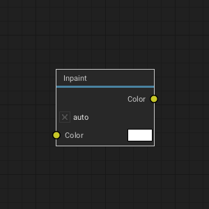
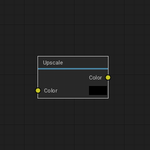

# Welcome

*Version [0.1](https://github.com/armory3d/armorlab_web/tree/main/manual.md)*

ArmorLab is a stand-alone software designed for AI-powered texture authoring. Generate PBR textures using text prompts or by drag & dropping your photos.

> The preview version has many rough edges and the experience may be frustrating.

---

# Download

**Windows** build is available. **Linux** (cpu only) and **macOS** (apple silicon only) builds also provided. On desktop, ArmorLab is a portable application with no installation - just unpack and run.

> [Get ArmorLab](https://armorlab.org/download.html)

#### Requirements

ArmorLab runs on the GPU by default and the processing time depends on a graphics card performance. GTX 1060/6GB or better is recommended. Optionally, GPU inference can be disabled at the expense of processing time. With GPU inference disabled, ArmorLab benefits from multi-threaded CPU performance.

> See [Preferences](https://armorlab.org/manual#preferences) to tune performance.

#### Updating

Latest builds can be downloaded through your [Gumroad Library](https://gumroad.com/library). Alternatively, use the original email sent by Gumroad to access the download page.

> In ArmorLab, press `Help - Check for Updates...` to check if newer build is available.

     

# Get Started

<iframe style="top:0;left:0;width:100%;height:100%;max-width:560px;" src="https://www.youtube.com/embed/-PYPuZQsujs" frameborder="0" allow="accelerometer; autoplay; encrypted-media; gyroscope; picture-in-picture" allowfullscreen></iframe>

#### Windows

Unpack downloaded archive and run `ArmorLab.exe`. In some cases, Windows may prompt you with the unrecognized app dialog - press `More Info - Run Anyway`.

#### Linux

Unpack downloaded archive and run `ArmorLab`. In some cases, you may need to open terminal in the extracted folder and run `./ArmorLab`.

#### macOS

Unpack downloaded archive and run `ArmorLab.app`.

#### iOS

Coming soon.

#### Android

Coming soon.

#### Controls

- `Left mouse button / Pen` to paint a mask.
- `Alt` + `left mouse button` to rotate the camera.
- `Alt` + `middle mouse button` to pan the camera.
- `Alt` + `right mouse button` / `mouse wheel` to zoom in and out.
- Controls can be customized in `Menu bar - Edit - Preferences... - Keymap`.
- Keymap presets can be imported and exported.

     

# Workflow

#### Import Textures

Drag and drop `.jpg`, `.png`, `.tga`, `.bmp`, `.gif`, `.psd`, `.hdr`, `.svg` or `.tif` images into the node editor. This will import the image and place a new `Image` node onto the canvas.

> See `Menu bar - Preferences... - Plugins` to enable support for additional image formats.

> You can get starter content in the [ArmorPaint Cloud](https://armorpaint.org/cloud).

#### Import Meshes

Drag and drop unwrapped `.obj` file into the viewport. This will replace the currently painted mesh. `.fbx`, `.blend`, `.stl`, `.gltf` and `.glb` files are supported, but the importer is not 100% reliable yet.

Modifying imported mesh data:
- Normals can be re-calculated with `Meshes tab - Calculate Normals`.
- Up axis can be set with `Meshes tab - Rotate X / Rotate Y / Rotate Z`.
- Geometry can be re-centered with `Meshes tab - Geometry to Origin`.
- Height output can be applied to geometry with `Meshes tab - Apply Displacement`.
- UV map can be auto-generated by enabling the `uv_unwrap` plugin.

> See `Menu bar - Preferences... - Plugins` to enable support for additional mesh formats.

> You can get sample assets for testing in the [ArmorPaint cloud](https://armorpaint.org/cloud).

#### Export Textures

Click on the `Menu bar - File - Export Textures...` button.

- `Resolution`: Set resolution for exported textures.
- `Color`: Set `8bit`, `16bit` or `32bit` color depth.
- `Format`: `.png` or `.jpg` (for `8bit` color), `.exr` (for `16bit / 32bit` color).
- `Preset`: Select a pre-configured preset or build a custom one.
  - `Generic` preset exports individual PBR textures.
  - `Unreal` preset exports packed *occlusion-roughness-metallic* texture.
  - `Unity` preset exports packed *metallic-occlusion-smoothness* texture.
  - `Minecraft` preset exports packed *metallic-emission-roughness* texture.
- `Destination`: Export textures to disk or pack into the project file at `Textures tab`.

Configure custom channel swizzling for exported textures in `Presets` tab:
- Select an existing preset you wish to edit or press `New`.
- Press `Import` to import preset from `.json` file.
- Press `Add` to create new texture slot.
- Configure `RGBA` channels for each texture slot.
- Right-click on texture name and press `Delete` to delete texture slot.
- `.json` file for each preset is located in the `ArmorLab/data/presets` folder.

#### Save / Load Project

Click on the `Menu bar - File - Save` button (`Ctrl + S`) to save the currently opened project. Mesh, nodes and textures will be saved into `.arm` project file.

To open the project file, drag and drop `.arm` file onto the viewport. `.arm` files can also be set to open directly with ArmorLab executable from the OS file explorer.

`.jpg` and other asset types can also be associated if you wish to use ArmorLab as a texture viewer.

#### Browser

Click on the `Status bar - Browser tab` to activate the built-in asset browser.
- Click on the `Cloud` button to access the [ArmorPaint cloud](https://armorpaint.org/cloud).
- Drag assets from browser into the viewport to import.
- Click on the `+` button to save the current path into bookmarks panel.
<!--   -->

     

# Nodes

Texture processing in ArmorLab is done via composing node graphs in node editor.
- Use toolbar at the top to add new nodes.
- Press `space` to search for nodes.
- Drag textures from `Textures tab` or file explorer into the node editor to create `Image` nodes.

Node preview is displayed instantly in the viewport as the nodes are assembled.

#### Photo to PBR Node

Extract base color, occlusion, roughness, normal map and height from color input. A photo image is expected as a color input.

#### Image Texture Node

Reference to a texture file from disk.

#### Text to Photo Node

Generate a photo described via text prompt.

#### Tiling Node

Outputs a tileable texture with removed seams from color input.

#### Inpaint Node

Allows to paint a mask in the viewport. Outputs a texture where mask area is filled with new content.

#### Upscale Node

Upscales color input to the current project resolution selected in the node editor header.

#### Variance Node

Generates a new image variant guided with text prompt.

#### Output Node

Final node which is used when exporting textures to disk.

> Check out the [gallery](https://armorlab.org/gallery.html) to see nodes in action.

     

# Viewport

<!--  -->

Set viewport parameters in `Menu bar - Viewport`.

- Enable `Distract Free` (`F11`) mode.
- `Toggle Fullscreen` (`alt+enter`) mode.
- Set `Environment` and `Light` intensity.
- Set `Light Size`.
- Enable `Cull Backfaces` to skip drawing backward facing polygons.
- Enable `Filter Textures` to apply linear filter when sampling textures references by material.
- Show 3D `Compass` in the viewport.
- Enable `Envmap` to draw environment map in the viewport.
- Enable `Blur Envmap` to use blurred version of the environment map.

> Drag and drop a `.hdr` file onto the viewport to change the environment map.

> Hold `Shift` + `middle mouse button` to rotate light.

> Hold `Ctrl` + `middle mouse button` to rotate environment map.

> To simulate pixel-art like texturing, disable `Filter Textures` option and set `Super Sample` in preferences to `0.25x`.
<!-- >   -->

#### Viewport Mode

Set viewport render mode in `Menu bar - Mode`.
- Pick `Lit` to draw viewport with applied lighting using the rasterizer.
- Pick specific channel to visualize it with no applied lighting.
- Pick `Path Traced` to draw viewport with interactive path-tracer. (*[ArmorLabDXR](https://github.com/armory3d/armorlab/blob/master/Assets/readme/readme_dxr.txt) and [ArmorLabVKRT](https://github.com/armory3d/armorlab/blob/master/Assets/readme/readme_vkrt.txt) builds*)

#### Path Traced Viewport *wip*

- Available in ArmorLabDXR and ArmorLabVKRT builds (see [dxr requirements](https://github.com/armory3d/armorlab/blob/master/Assets/readme/readme_dxr.txt) and [vkrt requirements](https://github.com/armory3d/armorlab/blob/master/Assets/readme/readme_vkrt.txt)).
- The renderer favors performance.

<!-- 
<iframe style="top:0;left:0;width:100%;height:100%;max-width:560px;" src="https://www.youtube.com/embed/uQb-LOJdYrE" frameborder="0" allow="accelerometer; autoplay; encrypted-media; gyroscope; picture-in-picture" allowfullscreen></iframe>
 -->

#### Camera

Set camera parameters in `Menu bar - Camera`:

- Set specific camera viewpoint.
- `Orbit`, `Zoom In` and `Zoom Out` camera.
- `Reset` camera.
- Set `FoV` (field of view).
- Set `Perspective` or `Orthographic` camera type.
- Set camera mode:
  - `Orbit` - Rotate camera around the mesh.
  - `Rotate` - Rotate mesh around the origin.
  - `Fly` - Hold `right mouse button` and move camera freely using the `WASD` and `QE` keys.

     

# Workspaces

<!--  -->

Select workspace tab from the header bar:
- `3D`: Set for 3D view.
- `2D`: Set for top-down view of the plane object.

     

# Preferences

<!--  -->

Click `Menu bar - Edit - Preferences...` to show the preferences window.

#### Interface

- `Language`: Set localization. See [currently available translations](https://github.com/armory3d/armorlab/tree/master/Assets/locale).
- `UI Scale`: Scale up the user interface when running on high-resolution display. By default, 2X scale is applied during the first startup for high-resolution displays.
- `Camera Speed`: Intensity of camera movements.
- `Direction to Zoom`: Mouse / pen direction to perform camera zoom.
- `Wrap Mouse`: Wrap mouse around view boundaries during camera control.
- `Show Asset Names`: Draw labels below each texture icon.
- Click `Restore - Confirm` button to revert back to default settings.
- Click `Restore - Import...` button to import settings from older ArmorLab version.
- Click `Reset Layout` button to revert all layout changes.

#### Theme

- Select `default` (dark) or `light` theme.
- Click `New` button to create custom theme.
- Click `Import` button to import theme from file.
- Click `Export` button to export theme into file.
- Set `Viewport Color` to draw when environment map is hidden.
- Set color and size of individual theme elements.
- Set `Straight` or `Curved` link style for node connections.

#### Usage

- `Undo Steps`: Set the number of undo steps to keep. Using less undo steps may improve performance when running on GPU with constrained memory.
- `Default Workspace`: start-up workspace.
- `Default Layer Resolution`: for new layers.
- `Cloud Server`: address of the S3 server used by `Browser tab - Cloud`.
- `GPU Inference`: Use GPU to accelerate node graph processing.
<!-- - `3D Cursor`: Enable topological warp for paint cursor with depth and angle rejection.
- `Live Node Preview`: Update nodes immediately during node editing. -->
<!--   -->

#### Pen

- `Brush Radius`: When painting with a pen, pressure affects the radius of brush.
- `Sensitivity`: Manual pen pressure sensitivity control.

> ArmorLab uses `Windows Ink` API on Windows. `Windows Ink` is available on Windows 8 or newer.

> When using a Wacom tablet on Windows, ensure `Use Windows Ink` option is enabled in [Wacom Tablet Properties](https://armorlab.org/manual/img/manual/wacom.png).

> When using a Wacom tablet on Windows, you can rotate the viewport by assigning `Alt` + `Left click` modifier onto pen button in [Wacom Tablet Properties](https://armorlab.org/manual/img/manual/wacom_button.png).

> Pen pressure is expected to work on Windows, Linux, macOS, Android and iOS.

#### Viewport

On faster GPUs:
- Raise `Super Sample` to 2X/4X for improved anti-aliasing.
- Enable `Voxel AO` for cone-traced ambient occlusion and shadows (non DXR / VKRT builds).

On slower GPUs:
- Disable `SSAO (screen-space ambient occlusion)` for improved performance.

Additional options:
- Set `Path Tracer` mode: `Core` for performance, `Full` for features. (DXR / VKRT builds)
- Set clipping values with `Clip Start` and `Clip End`.
- Enable `SSR` for screen-space reflections.
- Enable `Bloom`.
- Set `Vignette` intensity.
- Set `Displacement Strength` applied by height channel in the viewport.

#### Keymap

Select an existing preset or define custom keyboard shortcuts.
- Use `left`, `middle`, `right` handles to reference mouse buttons / pen.
- Use `+` character to reference multiple keys: ie. `ctrl+1`.
- Click `Import` button to import keymap from file.
- Click `Export` button to export keymap into file.

     

# Plugins

<!--  -->

Press `Plugins tab - Manager` to open the plugin manager.

- Click `Import` to install a new plugin from `.js`, `.wasm` or `.zip` file.
- Click `New` to create a new hello-world plugin.
- Enable desired plugins from the list.
- Right-click onto plugin name to expose plugin operations:
  - `Export` plugin file for distribution.
  - `Edit` plugin in a text editor.
  - `Delete` plugin.
- Controls for enabled plugins are displayed in the `Plugins tab`.
- Some plugins may not expose controls but add new import / export file formats.

#### Plugin Development

Plugins are written in `JavaScript` or `WebAssembly` (compiled from `C`, `Rust`, ..). For a minimal example, see the [bundled](https://github.com/armory3d/armorlab/tree/master/Assets/plugins) `hello_world.js` file located in the `ArmorLab/data/plugins` folder.

A [plugin development guide](https://github.com/armory3d/armorlab/wiki/Plugins) will be provided soon.

     
