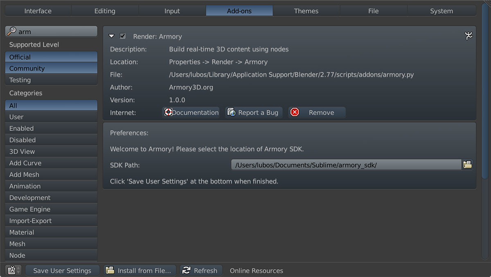
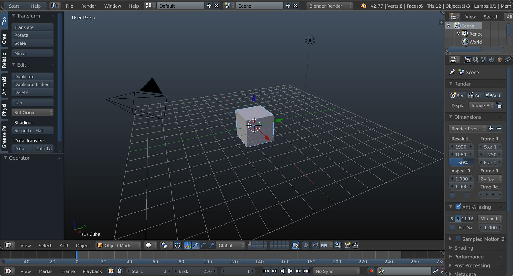

# Setup

## Blender
We do not bundle Blender with the SDK, but installing it is straightforward. You can get it for free at [blender.org](https://www.blender.org/download/). Version 2.77 or newer is recommended. After installing Blender, start it up and let's move on to installing Armory itself.

## Armory

- Unpack the Armory SDK .zip to your preferred location
- In Blender, Select 'File' - 'User Preferences...' and navigate to 'Add-ons' tab
- Select 'Install from File' at the bottom
- Locate your copy of unpacked Armory SDK and select 'armory.py'.
- Enter the path of your unpacked Armory SDK into Preferences panel
- Hit 'Save User Settings'

- To verify everything is working correctly, save your .blend file and hit 'Start' button.

- Hit 'Play in Viewport' to render the scene using Armory

If you are experiencing issues, please take a look at the [troubleshooting](troubleshooting.md) page. Otherways, feel free to proceed to [scene compositing](../scene/compositing.md).

Note: Armory player is a separate process running in a frameless window. We choose this approach to prevent a need for modified Blender build. 

Note: 'Dark Blue Gradient' theme is used, which comes bundled with Blender.
